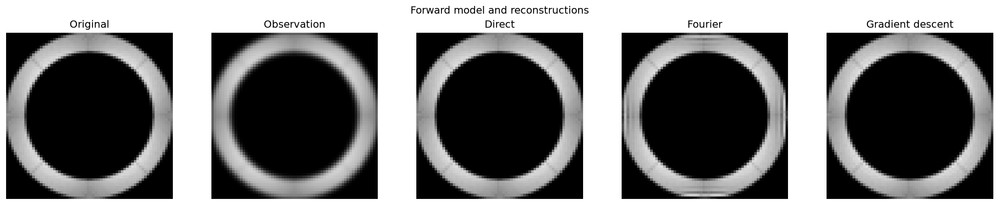

# Deconvolution Lab

A numerical laboratory for studying **convolution-based inverse problems** through
controlled 2D experiments.

Given

$$
b = h * x
$$

the project investigates how reconstruction methods
behave under different operator and boundary assumptions.

The **Solar Gravitational Lens (SGL)** is a motivating application, but this is
not an SGL reconstruction pipeline.

> **Status:** An ongoing exploration. The current experiments look at how
> inversion methods behave under different convolution and boundary
> assumptions. I expect the project to grow as I learn more about inverse
> problems.

## Question

How do different inversion methods behave when the forward operator and
boundary model are varied?

The experiments focus on the difference between **circular convolution**, where
Fourier methods diagonalize the operator, and **finite-domain (fill) convolution**.

## Methods

| Method           | Representation                           | Boundary    |
| ---------------- | ---------------------------------------- | ----------- |
| Direct           | Dense convolution matrix + least squares | Fill / wrap |
| Fourier quotient | DFT-domain inversion                     | Circular    |
| CGLS             | Matrix-free FFT forward/adjoint          | Fill        |
| Gradient descent | Matrix-free FFT forward/adjoint          | Fill        |

The Fourier method is extremely efficient for circular convolution, but using it
on fill-blurred data introduces a deliberate model mismatch.

## Findings



* Fourier inversion is much faster, but exhibits wrap-around artefacts when the
  boundary model is mismatched.
* Direct inversion reconstructs the fill problem accurately at small scales,
  but its dense operator becomes prohibitively expensive.
* Matrix-free iterative methods avoid storing the dense operator while solving
  the correct finite-domain problem.
* When both blur and inversion use wrap boundaries, direct and Fourier methods
  agree closely.

The repository also includes scaling experiments comparing computational cost
as image size increases.

## Scope

**Implemented:** Controlled convolution/deconvolution with known PSFs and
explicit boundary models.

**Motivation:** Inverse problems relevant to SGL imaging.

**Not implemented:** Realistic SGL operators, noise, regularization, spatially
varying PSFs, or additional inverse methods.

## Running

```bash
pip install -r requirements.txt
pip install pytest

python -m pytest -v
python scripts/main.py
python scripts/analyze_scaling.py
python scripts/benchmark.py
```

See [`docs/HOW_IT_WORKS.md`](docs/HOW_IT_WORKS.md),
[`docs/MATH.md`](docs/MATH.md), and [`docs/RUNNING.md`](docs/RUNNING.md) for
the mathematical and implementation details.

## Reference

[V. T. Toth and S. G. Turyshev, *Image recovery with the solar gravitational lens* (2021)](https://arxiv.org/abs/2012.05477v2)

## Scope

The experiments use known point-spread functions and controlled boundary
models. The Solar Gravitational Lens is a motivation, not an implemented
reconstruction pipeline.
